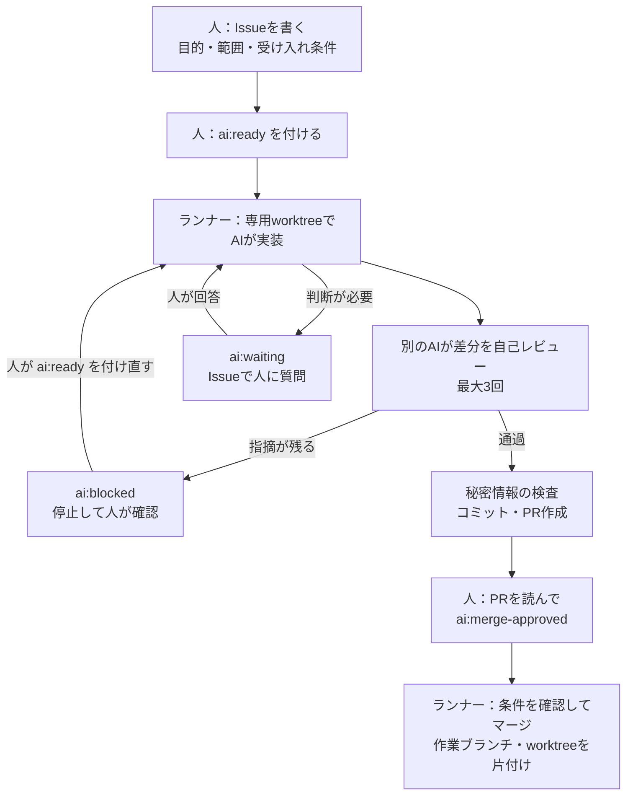

# AIで開発を回す仕組み（Claude Code・Codex）

Claude Code と Codex を使って、業務システムを継続的に開発・運用している進め方をまとめたものです。
「AIに書かせる」だけで終わらせず、**AIに渡すルール、作業の単位、レビューと承認、事故を防ぐ仕組み**まで含めて整えています。

実際に使っているルールファイルやIssueの書き方を、どのプロジェクトでも使える形に一般化して `templates/` に置いています。

## 実績

社内向けの業務システム（非公開）で、この進め方を使っています。

| 期間 | コミット | マージしたPR | Issue |
|---|---|---|---|
| 2026年7月29日〜9月28日（約2か月） | 733 | 212 | 93 |

同じ仕組みを、ほかに2つのプロジェクトでも運用しています（計3プロジェクト）。

## 人とAIの役割分担

| 担当 | やること |
|---|---|
| 人 | 目的と優先順位を決める。Issueに対応範囲と受け入れ条件を書く。PRを読んでマージを承認する。外部への送信や本番データに関わる判断をする |
| Claude Code・Codex（対話） | 設計の相談、実装、既存テストと静的検査での確認、差分の自己レビュー |
| Codex（自動ランナー） | 承認済みのIssueを専用の作業場所で実装し、別のAIが自己レビューしてからPRを作る。承認されたPRのマージと後片付け |

多くの開発は、Claude Code や Codex と対話しながら進めています。
小さく独立した作業は、Issueにラベルを付けるだけで自動ランナーに任せています（2026年9月に導入）。

## Issueからマージまでの流れ

ラベルごとの状態と、ランナーが確認している条件は [docs/runner-flow.md](docs/runner-flow.md) にまとめています。

## 事故を防ぐための決まり

AIに任せる範囲を広げるほど、「やってはいけないこと」を仕組みで止めることが大事になります。

- **認証情報をAIに渡さない**：AIの実行環境には、GitHubやDBの認証情報を渡しません。コミットやPR作成は、AIではなくランナー側が行います。
- **公開前に秘密情報を検査する**：追加した行とPR本文を、APIキーなどよくある認証情報の形式で確認し、疑わしいものがあれば止めます。
- **自動でマージしない変更を決めておく**：DBのマイグレーションや依存関係の変更は、自動ではマージしません。人がバックアップと適用先を確認してから取り込みます。
- **承認した内容だけを取り込む**：PR作成時のコミットと、承認時のコミットが一致する場合だけマージします。後から追加されたコミットは自動では取り込みません。
- **二重に着手しない**：同じIssueを重ねて処理しないよう、ロックと状態ラベルで管理します。
- **作業場所を分ける**：作業ごとに専用のworktreeを作り、主の作業場所や他の作業を汚しません。未保存の変更がある場所は、自動で上書きも削除もしません。

## AIに守らせているルール

ルールは `AGENTS.md`（Codex用）に書き、`CLAUDE.md`（Claude Code用）から読み込んで、両方のAIで共通にしています。要点は次のとおりです。

- **いまの開発段階を明示する**：試作の段階では、網羅性より「主な流れが動くこと」を優先する。一方で、二重送信の防止、データ消失の防止、秘密情報の保護、既存の動作を壊さないことは省略しない。
- **設計はIssueに書く**：設計だけのファイルやPRは作らない。目的・範囲・受け入れ条件をIssueにまとめ、経緯はIssueとPRから追えるようにする。
- **作業場所の決まり**：`main` から作業ブランチとworktreeを作り、PR経由で取り込む。終わったら、自分が作ったものを片付ける。
- **テストの扱いを決めておく**：既存のテストを理由なく消したり弱めたりしない。テストを増やす範囲は段階に合わせて人が判断する。
- **コメントの書き方**：コードを読めば分かることは書かない。二重送信・排他・認証情報など、「なぜそうしているか」が分からない制約を中心に残す。

一般化した全文は [templates/AGENTS.md](templates/AGENTS.md) です。

## レビューで効いた工夫

- **指摘がなくなるまで繰り返す**：1回のレビューで直すと、直した部分はまだ誰も見ていない状態になります。指摘がゼロになるまでレビューを繰り返します。
- **対になる処理を洗い出す**：保存と読み込み、作成と削除のように対になる処理は、片方だけ直すと同じ種類の抜けが残ります。
- **既存の動作を断定する前に確かめる**：「今はこう動いている」という前提が1つ外れると、指摘全体が使えなくなります。コードや実行結果で裏を取ります。
- **テストは、修正を戻すと失敗することを確かめる**：修正の前後で結果が変わらないテストは、何も守っていません。

観点の一覧は [docs/review-checklist.md](docs/review-checklist.md) にまとめています。

## 見本ファイル

| ファイル | 内容 |
|---|---|
| [templates/AGENTS.md](templates/AGENTS.md) | AIに渡す開発ルール（Codex・Claude Code共通） |
| [templates/CLAUDE.md](templates/CLAUDE.md) | Claude Code から AGENTS.md を読み込む設定 |
| [templates/issue-template.md](templates/issue-template.md) | AIに任せるIssueの書き方 |
| [docs/runner-flow.md](docs/runner-flow.md) | 自動ランナーの状態ラベルと、各段階で確認していること |
| [docs/review-checklist.md](docs/review-checklist.md) | 差分レビューの観点 |

## ライセンス

[MIT License](LICENSE)
